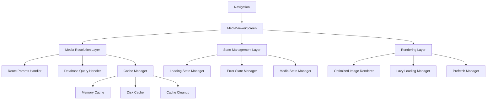
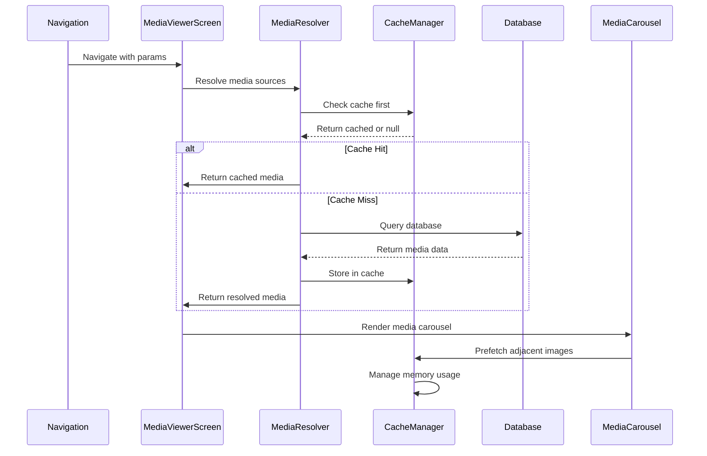

# Design Document

## Overview

The MediaViewerScreen optimization focuses on creating a robust, performant media viewing experience for React Native (Expo SDK 54+) applications. The current implementation suffers from infinite loading states, poor error handling, and suboptimal performance. This design addresses these issues through a comprehensive architecture that includes intelligent media resolution, advanced caching strategies, optimized rendering, and proper state management.

The solution implements a multi-layered approach: immediate display of available media, progressive loading with fallbacks, memory-efficient caching, and comprehensive error handling. The design prioritizes user experience while maintaining developer-friendly debugging capabilities.

## Architecture

### High-Level Architecture



### Component Architecture

The MediaViewerScreen will be restructured into several focused components:

1. **MediaViewerScreen (Main Container)**: Orchestrates all sub-components and manages overall state
2. **MediaResolver**: Handles media source resolution with fallback strategies
3. **MediaCarousel**: Optimized FlatList-based image carousel with prefetching
4. **MediaItem**: Individual media item renderer with loading states
5. **CacheManager**: Handles image caching and memory management
6. **LoadingStateManager**: Manages loading, error, and empty states

### Data Flow



## Components and Interfaces

### MediaResolver Interface

```typescript
interface MediaResolverConfig {
  routeParams: RouteParams;
  cacheManager: CacheManager;
  maxRetries: number;
  timeoutMs: number;
}

interface MediaItem {
  id: string;
  url: string;
  type: 'image' | 'video';
  thumbnailUrl?: string;
  metadata?: {
    width?: number;
    height?: number;
    size?: number;
  };
}

interface MediaResolutionResult {
  media: MediaItem[];
  source: 'cache' | 'params' | 'database';
  loadTime: number;
}
```

### CacheManager Interface

```typescript
interface CacheConfig {
  maxMemoryItems: number;
  maxDiskSizeMB: number;
  ttlHours: number;
  compressionQuality: number;
}

interface CacheManager {
  get(url: string): Promise<string | null>;
  set(url: string, data: string, metadata?: CacheMetadata): Promise<void>;
  prefetch(urls: string[]): Promise<void>;
  cleanup(): Promise<void>;
  getStats(): CacheStats;
}
```

### MediaCarousel Interface

```typescript
interface MediaCarouselProps {
  media: MediaItem[];
  initialIndex: number;
  onIndexChange: (index: number) => void;
  prefetchCount: number;
  renderItem: (item: MediaItem, index: number) => ReactElement;
}
```

### State Management Interfaces

```typescript
interface MediaViewerState {
  media: MediaItem[];
  currentIndex: number;
  loading: boolean;
  error: string | null;
  cacheStats: CacheStats;
  resolutionSource: 'cache' | 'params' | 'database' | null;
}

interface LoadingState {
  isLoading: boolean;
  progress?: number;
  estimatedTime?: number;
  retryCount: number;
}
```

## Data Models

### Enhanced Media Item Model

```typescript
interface MediaItem {
  id: string;
  url: string;
  type: 'image' | 'video';
  thumbnailUrl?: string;
  metadata: {
    width?: number;
    height?: number;
    size?: number;
    format?: string;
    uploadedAt?: string;
  };
  cacheInfo: {
    isCached: boolean;
    cacheKey: string;
    lastAccessed?: string;
  };
  loadingState: {
    status: 'pending' | 'loading' | 'loaded' | 'error';
    progress?: number;
    error?: string;
  };
}
```

### Cache Metadata Model

```typescript
interface CacheMetadata {
  url: string;
  cacheKey: string;
  size: number;
  createdAt: string;
  lastAccessed: string;
  accessCount: number;
  compressionRatio?: number;
}

interface CacheStats {
  totalItems: number;
  totalSizeMB: number;
  hitRate: number;
  memoryUsageMB: number;
  diskUsageMB: number;
}
```

### Route Parameters Model

```typescript
interface MediaViewerRouteParams {
  // Primary data sources (in priority order)
  media?: MediaItem[];           // Pre-loaded media array
  mediaItems?: MediaItem[];      // Alternative media array
  postId?: string;              // For database queries
  
  // Navigation options
  initialIndex?: number;         // Starting image index
  
  // Post context (for UI display)
  post?: {
    id: string;
    title?: string;
    content?: string;
    likeCount?: number;
    commentCount?: number;
    media?: MediaItem[];
  };
  
  // Performance options
  prefetchCount?: number;        // Number of adjacent images to prefetch
  cacheEnabled?: boolean;        // Enable/disable caching
}
```

## Error Handling

### Error Classification System

```typescript
enum MediaErrorType {
  NETWORK_ERROR = 'network_error',
  INVALID_URL = 'invalid_url',
  TIMEOUT = 'timeout',
  CACHE_ERROR = 'cache_error',
  DATABASE_ERROR = 'database_error',
  MEMORY_ERROR = 'memory_error',
  UNKNOWN = 'unknown'
}

interface MediaError {
  type: MediaErrorType;
  message: string;
  url?: string;
  retryable: boolean;
  retryCount: number;
  timestamp: string;
}
```

### Error Recovery Strategies

1. **Network Errors**: Automatic retry with exponential backoff (max 3 attempts)
2. **Timeout Errors**: Increase timeout and retry with lower quality if available
3. **Cache Errors**: Fall back to direct URL loading and rebuild cache
4. **Database Errors**: Use cached data if available, show error with manual retry
5. **Memory Errors**: Clear cache and reload with reduced quality settings

### Error UI States

```typescript
interface ErrorDisplayConfig {
  showRetryButton: boolean;
  showErrorDetails: boolean;
  fallbackImage?: string;
  customMessage?: string;
  actionButtons?: Array<{
    label: string;
    action: () => void;
  }>;
}
```

## Testing Strategy

### Unit Testing Approach

1. **MediaResolver Tests**
   - Test media resolution priority (params > cache > database)
   - Test error handling and retry logic
   - Test timeout scenarios
   - Mock database and cache dependencies

2. **CacheManager Tests**
   - Test cache hit/miss scenarios
   - Test memory management and cleanup
   - Test cache invalidation
   - Test concurrent access handling

3. **MediaCarousel Tests**
   - Test FlatList optimization
   - Test prefetching logic
   - Test index change handling
   - Test memory usage during scrolling

### Integration Testing Approach

1. **End-to-End Media Loading**
   - Test complete flow from navigation to display
   - Test different navigation scenarios
   - Test network failure recovery
   - Test cache persistence across app restarts

2. **Performance Testing**
   - Test memory usage with large image sets
   - Test loading times with different network conditions
   - Test cache effectiveness
   - Test UI responsiveness during loading

### Testing Utilities

```typescript
// Mock data generators
const createMockMediaItem = (overrides?: Partial<MediaItem>): MediaItem => { ... };
const createMockRouteParams = (overrides?: Partial<MediaViewerRouteParams>): MediaViewerRouteParams => { ... };

// Test helpers
const waitForMediaLoad = async (component: ReactTestInstance): Promise<void> => { ... };
const simulateNetworkError = (url: string): void => { ... };
const measureRenderTime = (component: ReactTestInstance): number => { ... };
```

## Performance Optimizations

### Image Loading Optimizations

1. **Progressive Loading**: Load low-quality placeholder first, then high-quality version
2. **Smart Prefetching**: Prefetch adjacent images based on scroll direction and velocity
3. **Adaptive Quality**: Adjust image quality based on network speed and device capabilities
4. **Lazy Loading**: Only load images when they're about to become visible

### Memory Management

1. **LRU Cache**: Implement Least Recently Used cache eviction
2. **Memory Monitoring**: Track memory usage and trigger cleanup when needed
3. **Image Recycling**: Reuse image components to reduce garbage collection
4. **Background Cleanup**: Periodically clean unused cache entries

### Rendering Optimizations

1. **FlatList Optimization**: Use getItemLayout, keyExtractor, and removeClippedSubviews
2. **Image Component**: Use expo-image instead of React Native Image for better performance
3. **Memoization**: Use React.memo, useMemo, and useCallback strategically
4. **State Batching**: Batch state updates to reduce re-renders

### Network Optimizations

1. **Connection Monitoring**: Adapt behavior based on network quality
2. **Request Deduplication**: Avoid duplicate requests for the same image
3. **Concurrent Limits**: Limit simultaneous image downloads
4. **Compression**: Use appropriate image compression for different scenarios

## Implementation Considerations

### Expo SDK 54+ Compatibility

1. **Image Component**: Use `expo-image` package for better performance and features
2. **Video Handling**: Implement video support using `expo-video` (not deprecated expo-av)
3. **File System**: Use `expo-file-system` for cache management
4. **Network Info**: Use `@react-native-community/netinfo` for connection monitoring

### Platform-Specific Optimizations

1. **iOS**: Utilize native image caching and memory management
2. **Android**: Handle different screen densities and memory constraints
3. **Web**: Implement browser-specific optimizations and fallbacks

### Accessibility Considerations

1. **Screen Reader Support**: Proper accessibility labels and hints
2. **High Contrast**: Support for high contrast mode
3. **Reduced Motion**: Respect reduced motion preferences
4. **Keyboard Navigation**: Support for keyboard navigation on web

### Security Considerations

1. **URL Validation**: Validate image URLs to prevent XSS attacks
2. **Cache Security**: Secure cache storage and prevent unauthorized access
3. **Network Security**: Use HTTPS for all image requests
4. **Content Filtering**: Basic content validation for uploaded images